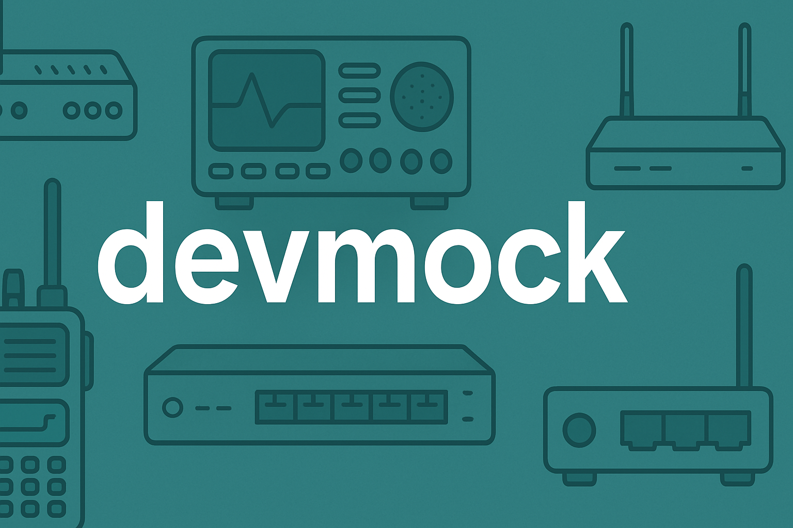

## Goal
Simulate basic telecommunication field devices supporting both SSH and Telnet protocols, providing a simple command-line interface (CLI), and including a mocked set of commands based on a user-defined JSON file.

This devices could be:
- Digital Radios
- Switches
- Routers

## Requirements
- Minimum Python version 3.13

## Init project
1. Install project packages
```python
pipenv install
```
2. Setup the `pipenv` virtual environment for the project
    - With VSC set the environment in the `Python environment tab`
    - With other IDE execute `pipenv shell` on the terminal
3. Launch the project
```python
python src/main.py
```
